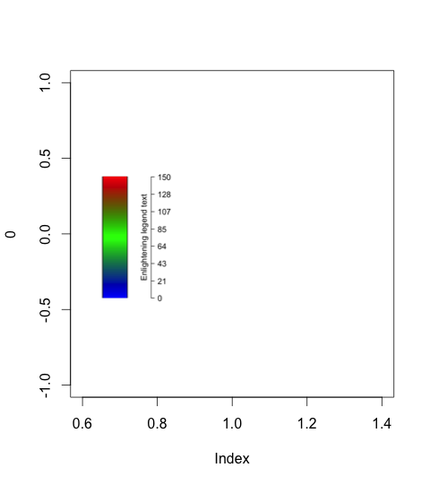

It can be a pain to add legend to plots, so here is one possible workaround that may help.  All credit for this idea goes to Michael Scroggie, whose code (which I found in the github repo [https://gist.github.com/scrogster/7fc5b7597b63585a00b6](https://gist.github.com/scrogster/7fc5b7597b63585a00b6) has inspired this.   Basically, create a legend and save it as a png (`my_legend.png` in the example below), then import the png from inside R, and add to the current plotting window.

Example legend code:
```
# Make a legend, and save it somewhere as "my_legend.png"
par(fig=c(0,1,0,1), oma = c(0,0,0,5), mar = c(0,0,2,5), bg = NA)
plot(c(0,0), type = "n", bg = NA, bty = "n")
n.cols  <- 300
ngrid   <- n.cols
brks    <- c(0.01, 150)
xvec    <- rep(0, n.cols)
brks    <- c(seq(brks[1], brks[2], length = ngrid + 1))
palette <- colorRampPalette(c("blue","green","red"))
cols    <- palette(n.cols)
par(fig=c(0,1,0,1), oma = c(1,0,0,5), mar = c(0,0,2,5), bg = NA)
plot(brks/500, brks, type = "n", xaxs = "i", yaxs = "i",
    yaxt = "n", xlab = "", ylab = "", main = "", bty = "n",
    xaxt = "n", xlim = c(-1, 1), bg = NA)
tick.subset  <- seq(1, n.cols, length.out = 8)
axis(4, at = brks[tick.subset], las=1,
         labels = round(c(brks[tick.subset]), 0), 
         ylog = F, lwd = 2, cex.axis = 1.5)
rect(0, 0.01, 0.5, 150, border = 1, lwd = 6)
rect(xvec, brks[-length(brks)], xvec + 0.5, 
    brks[-1], col = cols, border = NA)
mtext(side = 4, "Enlightening legend text", line = -1.5, cex = 1.5)
my_legend
```


Note that `par(bg = NA)` is used throughout, so that the legend has a transparent background, which is useful if we add to a plot that has details in the background we’d prefer not to obscure too much.

Now the legend is simply imported and stuck on a new plot window using Michael’s code (which I’ve only modified slightly):

```
library(png) 
library(RCurl) 
legend_png <- readPNG("my_legend.png") 

# utility function for embedding png images at specified fractional 
# sizes in R plots places the logo centred on a specified fraction 
# of the the usr space, and sizes appropriately 
# (respects aspect ratio) 
logoing_func<-function(logo, x, y, size){ 
   dims <- dim(logo)[1:2]  
   AR   <- dims[1]/dims[2] 
   par(usr=c(0, 1, 0, 1)) 
   rasterImage(logo, x-(size/2), y-(AR*size/2), 
       x+(size/2), y+(AR*size/2), interpolate=TRUE) 
} 
# create a minimal new plot 
plot(0, type = "n") 
# add the legend png 
logoing_func(legend_png, x = 0.2, y = 0.5, size = 0.5)
```


