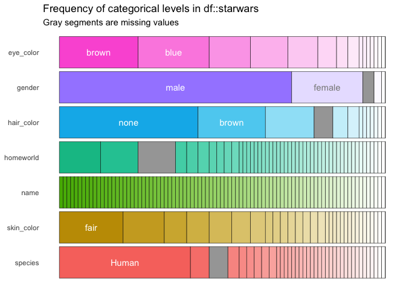
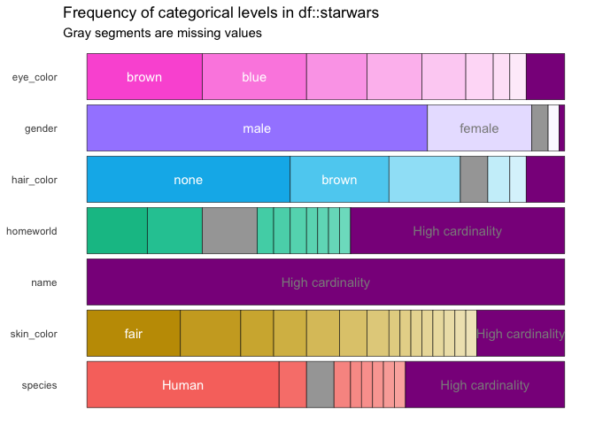
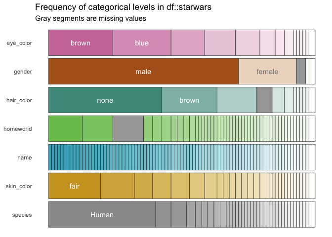
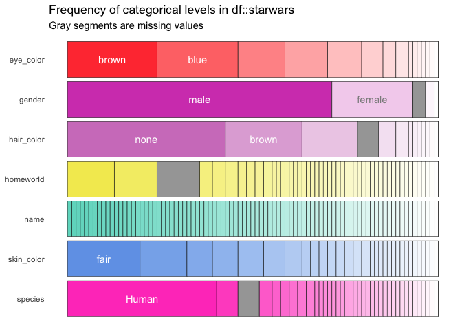

### Exploring categorical data with inspectdf

#### What’s `inspectdf` and what’s it for?

I often find myself viewing and reviewing dataframes throughout the
course of an analysis, and a substantial amount of time can be spent
rewriting the same code to do this. `inspectdf` is an R package designed
to make common exploratory tools a bit more useful and easy to use.

In particular, it’s very powerful be able to quickly see the contents of
categorical features. In this article, we’ll summarise how to use the
`inspect_cat()` function from `inspectdf` for summarising and
visualising categorical columns.

First of all, you’ll need to have the `inspectdf` package installed. You
can get it from github using

``` r
library(devtools)
install_github("alastairrushworth/inspectdf")
```

Then load the package in. We’ll also load `dplyr` for the `starwars`
data and for the pipe `%>%`.

``` r
library(inspectdf)
library(dplyr)

# check out the starwars help file
?starwars
```

#### Tabular summaries using `inspect_cat()`

The `starwars` data that comes bundled with `dplyr` has 7 columns that
have character class, and is therefore a nice candidate for illustrating
the use of `inspect_cat`. We can see this quickly using the
`inspect_types()` function from `inspectdf`.

``` r
starwars %>% inspect_types()
```

    ## # A tibble: 4 x 4
    ##   type        cnt  pcnt col_name 
    ##   <chr>     <int> <dbl> <list>   
    ## 1 character     7 53.8  <chr [7]>
    ## 2 list          3 23.1  <chr [3]>
    ## 3 numeric       2 15.4  <chr [2]>
    ## 4 integer       1  7.69 <chr [1]>

Using `inspect_cat()` is very straightforward:

``` r
star_cat <- starwars %>% inspect_cat()
star_cat
```

    ## # A tibble: 7 x 5
    ##   col_name     cnt common common_pcnt levels           
    ##   <chr>      <int> <chr>        <dbl> <list>           
    ## 1 eye_color     15 brown        24.1  <tibble [15 × 3]>
    ## 2 gender         5 male         71.3  <tibble [5 × 3]> 
    ## 3 hair_color    13 none         42.5  <tibble [13 × 3]>
    ## 4 homeworld     49 Naboo        12.6  <tibble [49 × 3]>
    ## 5 name          87 Ackbar        1.15 <tibble [87 × 3]>
    ## 6 skin_color    31 fair         19.5  <tibble [31 × 3]>
    ## 7 species       38 Human        40.2  <tibble [38 × 3]>

So what does this tell us? Each row in the tibble returned from
`inspect_cat()` corresponds to each categorical column (`factor`,
`logical` or `character`) in the `starwars` dataframe.

  - The `cnt` column tells you how many unique levels there are for each
    column. For example, there are 15 unique entries in the `eye_color`
    column.
  - The `common` column prints the most commonly occurring entry. For
    example, the most common `eye_color` is `brown`. The percentage
    occurrence is 24.1% which is shown under `common_pcnt`.  
  - A full list of levels and occurrence frequency is provided in the
    list column `levels`.

A table of relative frequencies of `eye_color` can be retrieved by
typing

``` r
star_cat$levels$eye_color
```

    ## # A tibble: 15 x 3
    ##    value           prop   cnt
    ##    <chr>          <dbl> <int>
    ##  1 brown         0.241     21
    ##  2 blue          0.218     19
    ##  3 yellow        0.126     11
    ##  4 black         0.115     10
    ##  5 orange        0.0920     8
    ##  6 red           0.0575     5
    ##  7 hazel         0.0345     3
    ##  8 unknown       0.0345     3
    ##  9 blue-gray     0.0115     1
    ## 10 dark          0.0115     1
    ## 11 gold          0.0115     1
    ## 12 green, yellow 0.0115     1
    ## 13 pink          0.0115     1
    ## 14 red, blue     0.0115     1
    ## 15 white         0.0115     1

There isn’t anything here that can’t be obtained by using the base
`table()` function with some post-processing. `inspect_cat()` automates
some of that functionality and wraps it into a single, convenient
function.

#### Visualising categorical columns with `show_plot()`

An important feature of `inspectdf` is the ability to visualise
dataframe summaries. Visualising categories can be challenging, because
categorical columns can be very rich and contain many unique levels. A
simple stacked barplot can be produced using `show_plot()`

``` r
star_cat %>% show_plot()
```

<!-- -->

Like the `star_cat` tibble returned by `inspect_cat()`, each row of the
plot is a single column, split by the relative frequency of occurrence
of each unique entry.

  - Some of the bars are labelled, but in cases where the bars are
    small, the labels are not shown. If you encounter categorical
    columns with really long strings, labels can be suppressed
    altogether with `show_plot(text_labels = FALSE)`.
  - Missing values or `NA`s are shown as gray bars. In this case, there
    are quite a few `starwars` characters whose `homeworld` is not
    unknown or missing.

#### Combining rare entries with `show_plot()`

Some of the categorical columns like `name` seems to have a lot of
unique entries. We should expect this - names often are unique (or
almost) in a small dataset. If we scaled this analysis up to a dataset
with millions of rows, there would be so many names with very small
relative frequencies that the name bars would be very difficult to see.
`show_plot()` can help with this too\!

``` r
star_cat %>% show_plot(high_cardinality = 1)
```

<!-- -->

By setting the argument `high_cardinality = 1` all entries that occur
*only once* are combined into a single group labelled *high
cardinality*. This makes it easier to see when some entries occur only
once (or extremely rarely).

  - In the above, it’s now obvious that no two people in the `starwars`
    data share the same name, and that many come from a unique
    `homeworld` or `species`.
  - By setting `high_cardinality = 2` or even greater, it’s possible to
    group the ‘long-tail’ of rare categories even further. With larger
    datasets, this becomes increasingly important for visualisation.
  - A practical reason to combine rare entries, is plotting speed - it
    can take a long time to render a plot with tens of thousands (or
    more) unique bars\! Using the `high_cardinality` argument can reduce
    this dramatically.

#### Playing with color options in `show_plot()`

It’s been pointed out that the default `ggplot` color theme isn’t
particularly friendly to color-blind audiences. A more [color-blind
friendly theme](http://www.cookbook-r.com/Graphs/Colors_\(ggplot2\)/) is
available by specifying `col_palette = 1`:

``` r
star_cat %>% show_plot(col_palette = 1)
```

<!-- -->

I’m also quite fond of the 80s theme by choosing `col_palette = 2`:

``` r
star_cat %>% show_plot(col_palette = 2)
```

<!-- -->

There are 5 palettes at the moment, so have a play around. Note that the
color palettes have not yet hit the CRAN version of `inspectdf` - that
will come soon in an update, but for now you can get them from the
github version of the package using the code at the start of the
article.

#### Comments? Suggestions? Issues?

Any feedback is welcome\! Find me on twitter at
[rushworth\_a](https://twitter.com/rushworth_a) or [write a github
issue](https://github.com/alastairrushworth/inspectdf/issues).
