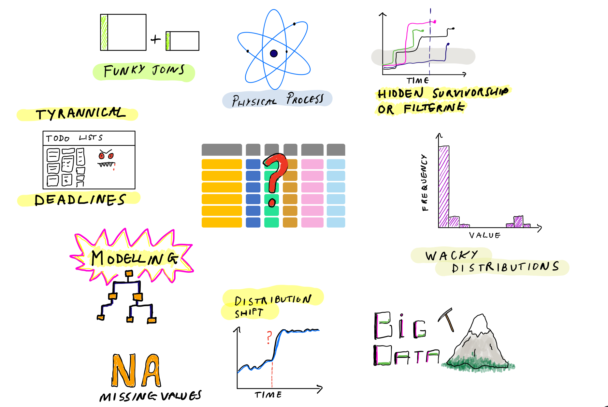
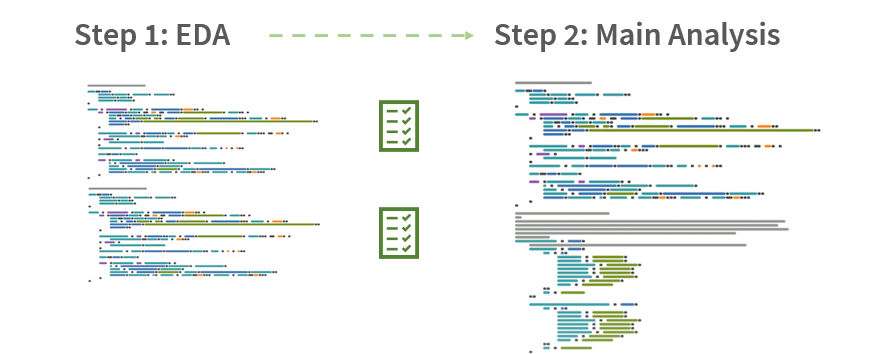
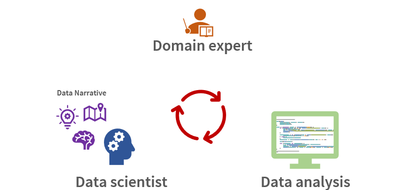
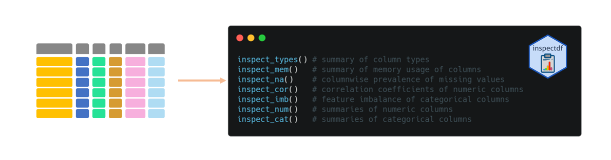
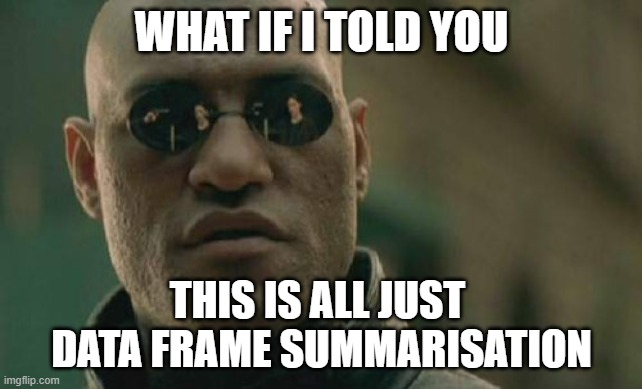
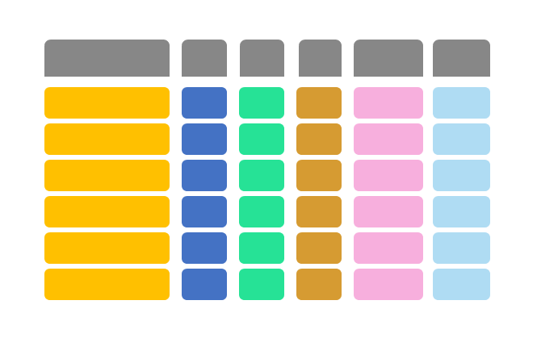
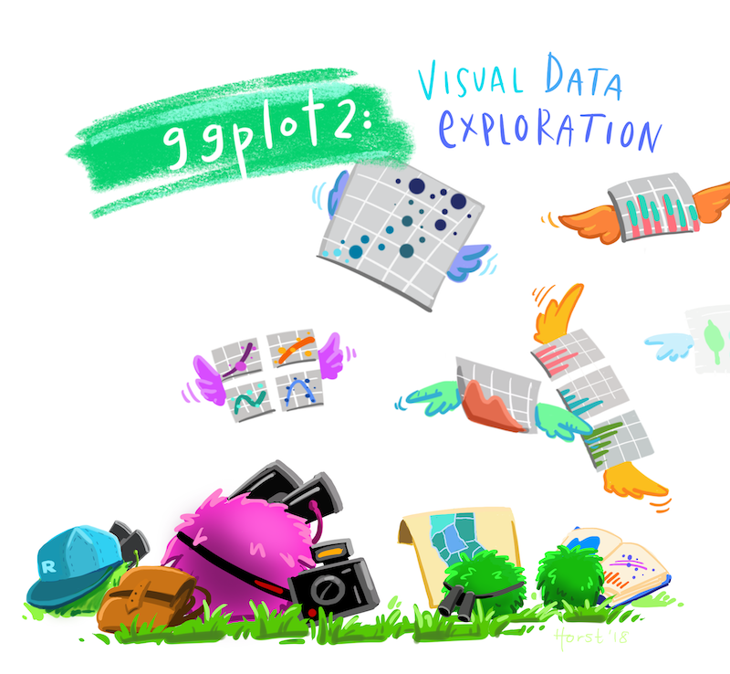

```{r setup, include=FALSE}
knitr::opts_chunk$set(echo = TRUE)
library(dplyr)
library(magrittr)
library(visdat)
library(DataExplorer)
library(inspectdf)
library(skimr)
```

```{r xaringan-themer, include=FALSE, warning=FALSE}
library(xaringanthemer)
style_mono_accent(
  header_font_google = google_font("Roboto"),
  text_font_google   = google_font("Roboto"),
  code_font_google   = google_font("IBM Plex Mono"),
  base_color = "#43418A")
```


<br><br>

<i><font size="6">"Exploration is curiosity put into action"</font></i>
<br>
<strong><font size="5">Don Walsh (American Oceanographer)</font></strong>


<br><br><br>
__In this talk__
+ What is EDA?
+ What is it for and why is it important?  
+ What are the tools and how can we do it better?

--

<br>
__Scenario__
+ You are working on a new project with a large data set (00's columns, M's rows)
+ The objective is to fit a model
+ You are relatively new to the subject area
+ How do you start?

---

### What makes EDA hard

<div style="text-align:center"></div>


---

### A strawman: how some people view EDA


<div style="text-align:center"></div>
<br><br>
<div style="text-align:right">Code minimaps by <a href='https://github.com/klmr/minimappr'>Konrad Rudolph</a></div>

---

### EDA is an iterative cycle of learning

<div style="text-align:center"></div>


---


## EDA packages in R

<br><br>

```{r, echo = FALSE, warning = FALSE, message = FALSE}
library(kableExtra)
library(lubridate)
shite_df<- 
  bind_rows(
    list(
      'Package' = 'skimr', 
      'URL'     = 'https://github.com/ropensci/skimr', 
      'Stars'   = 887, 
      'Forks'   = 72, 
      'cran' = '2018-01-10', 
      'Graphical' = "&#x274c;",
      'Tabular' = "&#x2714;&#xfe0f;",
      'Console' = "&#x2714;&#xfe0f;",
      'Report'  = "&#x274c;"
    ), 
    list(
      'Package' = 'DataExplorer', 
      'URL'     = 'https://github.com/boxuancui/DataExplorer/',
      'Stars'   = 360,
      'Forks'   = 67, 
      'cran' = '2016-03-01', 
      'Graphical' ="&#x2714;&#xfe0f;",
      'Tabular' = "&#x274c;",
      'Console' = "&#x274c;",
      'Report'  = "&#x2714;&#xfe0f;"), 
    list(
      'Package' = 'visdat', 
      'URL'     = 'https://github.com/ropensci/visdat',
      'Stars'   = 375,
      'Forks'   = 44, 
      'cran' = '2017-07-11', 
      'Graphical' = "&#x2714;&#xfe0f;",
      'Tabular' = "&#x2714;&#xfe0f;",
      'Console' = "&#x274c;",
      'Report'  = "&#x274c;"), 
    list(
      'Package' = 'inspectdf', 
      'URL'     = 'https://github.com/alastairrushworth/inspectdf',
      'Stars'   = 194,
      'Forks'   = 18, 
      'cran' = '2019-04-24',
      'Graphical' = "&#x2714;&#xfe0f;",
      'Tabular' = "&#x2714;&#xfe0f;",
      'Console' = "&#x274c;",
      'Report'  = "&#x274c;"), 
    list(
      'Package' = 'summarytools', 
      'URL'     = 'https://github.com/dcomtois/summarytools',
      'Stars'   = 389,
      'Forks'   = 56, 
      'cran' = '2014-08-11', 
      'Graphical' = "&#x274c;",
      'Tabular' = "&#x2714;&#xfe0f;",
      'Console' = "&#x274c;",
      'Report'  = "&#x2714;&#xfe0f;"), 
    list(
      'Package' = 'dlookr', 
      'URL'     = 'https://github.com/choonghyunryu/dlookr',
      'Stars'   = 97,
      'Forks'   = 18, 
      'cran' = '2018-04-27', 
      'Graphical' = "&#x2714;&#xfe0f;",
      'Tabular' = "&#x2714;&#xfe0f;",
      'Console' = "&#x274c;",
      'Report'  = "&#x2714;&#xfe0f;"), 
    list(
      'Package' = 'smartEDA', 
      'URL'     = 'https://github.com/daya6489/SmartEDA',
      'Stars'   = 20,
      'Forks'   = 7, 
      'cran'    = '2018-04-06', 
      'Graphical' = "&#x2714;&#xfe0f;",
      'Tabular' = "&#x2714;&#xfe0f;",
      'Console' = "&#x274c;",
      'Report'  = "&#x2714;&#xfe0f;")
  ) %>%
  mutate(cran = paste(month(ymd(cran), label = TRUE), year(ymd(cran)))) %>%
  mutate(Package = cell_spec(Package, "html", link = URL)) %>%
  select(Package, `First on CRAN` = cran, Stars, Forks, Graphical, Tabular, Console, Report) 
```

```{r, echo = FALSE, warning = FALSE, message = FALSE}
shite_df %>%
  kable("html", escape = FALSE, align = c('l', rep('c', 7))) %>%
  kable_styling(bootstrap_options = c("hover", "condensed"))
```

---


## EDA packages in R

<br><br>

```{r, echo = FALSE, warning = FALSE, message = FALSE}
shite_df %>%
  kable("html", escape = FALSE, align = c('l', rep('c', 7))) %>%
  kable_styling(bootstrap_options = c("hover", "condensed")) %>%
  row_spec(1:4, bold = T, background = "#faf6b1")
```


---

## First look - the basics 👀

Try `glimpse()`, a transposed version of `head()`:

```{r, size="huge"}
dplyr::glimpse(starwars)
```

---

### `skimr::skim()`

_A simple to use summary function that can be used with pipes and displays nicely in the console._


__Summary of package__
+ Pipeable syntax
+ Comprehensive summaries per data type
+ Console-centric, but dataframe summaries are available
---


### `skimr::skim()` 

Returns separate sections of printed output for each type in the data:

```{r, eval = FALSE}
skim(starwars)
```

```{r, eval = FALSE}
── Data Summary ────────────────────────
                           Values         
Name                       dplyr::starwars
Number of rows             87             
Number of columns          14             
_______________________                   
Column type frequency:                    
  character                8              
  list                     3              
  numeric                  3              
________________________                  
Group variables            None           
```

---

### `skimr::skim()` 

Returns separate sections of printed output for each type in the data:

```{r, eval = FALSE}
skim(starwars)
```

```{r, eval = FALSE}
── Variable type: character ─────────────────────────────────────────────────────────────────────────────────────────────
  skim_variable n_missing complete_rate   min   max empty n_unique whitespace
1 name                  0         1         3    21     0       87          0
2 hair_color            5         0.943     4    13     0       12          0
3 skin_color            0         1         3    19     0       31          0
4 eye_color             0         1         3    13     0       15          0
5 sex                   4         0.954     4    14     0        4          0
6 gender                4         0.954     8     9     0        2          0
7 homeworld            10         0.885     4    14     0       48          0
8 species               4         0.954     3    14     0       37          0
```

__For character columns:__
+ All the usual suspects: missingness, complete rate  
+ Also string characteristics: min, max, whitespace and emptiness

---
 
### `skimr::skim()` 

Returns separate sections of printed output for each type in the data:

```{r, eval = FALSE}
skim(starwars)
```

```{r, eval = FALSE}
── Variable type: list ──────────────────────────────────────────────────────────────────────────────────────────────────
  skim_variable n_missing complete_rate n_unique min_length max_length
1 films                 0             1       24          1          7
2 vehicles              0             1       11          0          2
3 starships             0             1       17          0          5
```

<br>

__For list columns:__
+ Missingness, complete rate  
+ Handy: Lengths of lists

---
  
### `skimr::skim()` 

Returns separate sections of printed output for each type in the data:

```{r, eval = FALSE}
skim(starwars)
```

```{r, eval = FALSE}
── Variable type: numeric ───────────────────────────────────────────────────────────────────────────────────────────────
  skim_variable n_missing complete_rate  mean    sd    p0   p25   p50   p75  p100 hist 
1 height                6         0.931 174.   34.8    66 167     180 191     264 ▁▁▇▅▁
2 mass                 28         0.678  97.3 169.     15  55.6    79  84.5  1358 ▇▁▁▁▁
3 birth_year           44         0.494  87.6 155.      8  35      52  72     896 ▇▁▁▁▁
```

__For numeric columns:__

+ Killer feature: spark histograms in the console.  
+ No faffing / toggling hundreds of `ggplots`!
---


## `visdat`

_Create preliminary exploratory data visualisations of an entire dataset to identify problems or unexpected features using ggplot2._


__Summary of package__
+ Visualisation-centric API
+ Emphasis on summarising and viewing the _whole dataframe_
+ Great for visualising location of attributes in the dataframe
---


### `visdat::vis_dat()` & `visdat::vis_miss()`

Visualise whole dataframes, for example types (left) and missing values (right)

.pull-left[
```{r, fig.width = 4, fig.height = 3.5, dpi = 120, fig.align = 'center'}
vis_dat(starwars)
```
]

.pull-right[
```{r, fig.width = 4, fig.height = 3.5, dpi = 120, fig.align = 'center'}
vis_miss(starwars)
```
]


---

## `inspectdf`

_A collection of utilities for columnwise summary, comparison and visualisation of data frames. Functions report missingness, categorical levels, numeric distribution, correlation, column types and memory usage._



_Summary of package_
+ Dataframe centric output, with option to plot each
+ Comparison _across_ data frames is emphasised
+ Disclaimer: I wrote this
---


### `inspectdf::inspect_cat()` 

Dataframe summarising categorical features in the data:

```{r, fig.width = 8, fig.height = 6, fig.align = 'center'}
inspect_cat(starwars) 
```

---

### `inspectdf::inspect_cat()` 

```{r, fig.width = 6, fig.height = 3.5, dpi = 120, fig.align = 'center'}
inspect_cat(starwars) %>% show_plot()
```

---

### `inspectdf::inspect_types()`

.pull-left[
```{r, fig.width = 3.5, fig.height = 3.5, dpi = 120, fig.align = 'center'}
inspect_types(starwars) %>% show_plot()
```
]

.pull-right[
```{r, fig.width = 3.5, fig.height = 3.5, dpi = 120, fig.align = 'center'}
inspect_types(starwars, starwars[, -2]) %>% 
  show_plot()
```
]


---


## `DataExplorer`

_Automate Data Exploration and Treatment._

<br><br>


<br>

_Summary of package_
+ All-in-one report creation tool, one-line interface
+ Output to common formats: eg. markdown or PDF
+ Not all column types supported (eg. lists)

---


### `DataExplorer::create_report()` 

```{r, fig.width = 8, fig.height = 6, dpi = 120, fig.align = 'center', eval = FALSE}
create_report(starwars %>% select(-films, -vehicles, -starships))
```

<br>


---

<div style="text-align:center"></div>

<!-- --- -->

<!-- ## Avoid data frame tunnel vision -->

<!--  -->


---

<div style="text-align:center"></div>
<div style="text-align:right">Artwork by <a href='https://twitter.com/allison_horst'>@allison_horst</a></div>

---

<!-- ### EDA is an iterative cycle of learning -->

<!-- <div style="text-align:center"></div> -->


<!-- --- -->


## Your brain is the most important ingredient

```{r, echo=FALSE,message=FALSE,warning=FALSE, fig.width=8, cache = TRUE}
library(tweetrmd)
tweet_screenshot("https://twitter.com/rushworth_a/status/1369322852898508802")
```


---

## Tips: Supercharge your EDA with questions

__Make friends with your local experts!__

+ Ask them to talk broadly about the data / process
+ Then ask your burning questions

--

__Ask yourself questions__

+ No really!
+ _Does this make sense?_
+ _Do I understand this?_

--

__Find a colleague to discuss the topic with__

+ Aim to condense the problem statement into an accessible summary
+ Invite their questions - these will rapidly expose holes in your understanding
+ Remember it's ok not to know 

--

__As questions expose new gaps, find creative ways to analyse the data to learn or confirm a new idea__

---

## A definitely true fact

<br><br><br><br><br>

<strong><font size="6">80% of data science failures are avoidable by asking the right questions early enough.</font></strong>


---

<br><br><br>
<div style="text-align:center"></div>
<br><br>
<div style="text-align:right">
<a href ='https://thedatasciencekernel.com/2021/01/24/exploratory-data-analysis-whats-the-point/'>Related blog post: "Exploratory Data Analysis - What's the point?"</a></div>
---


